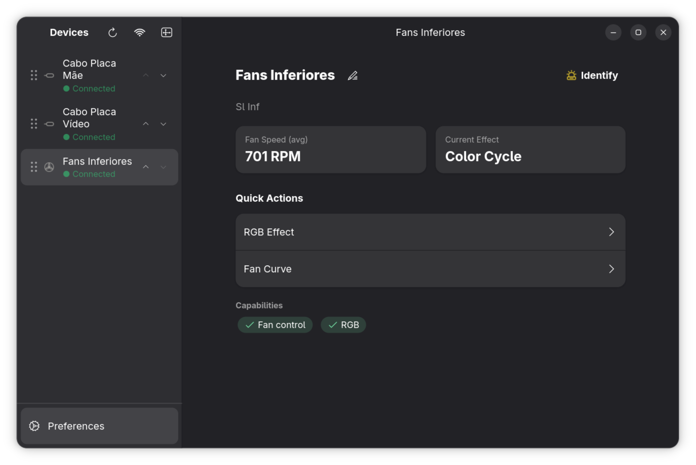
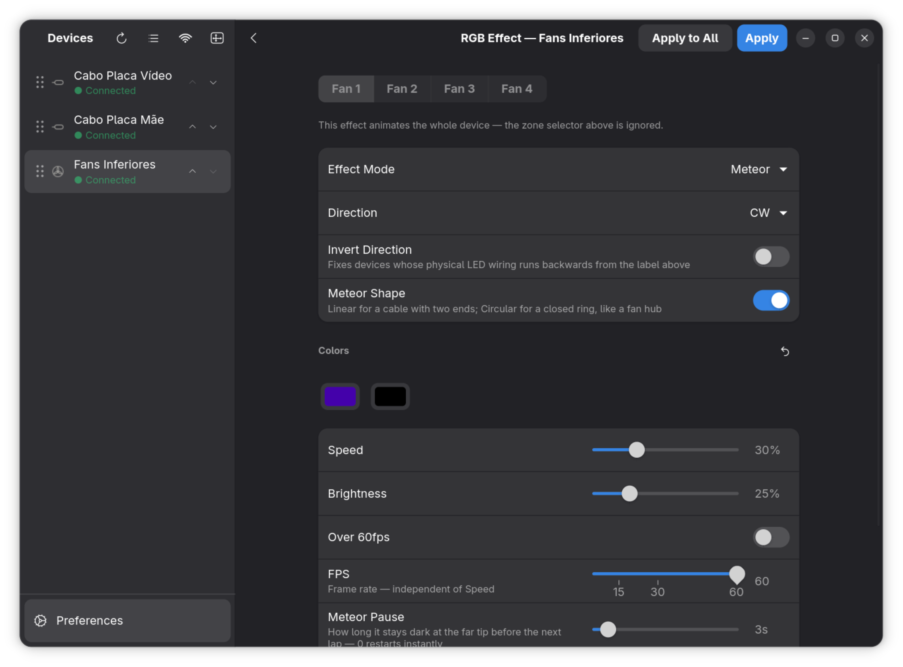
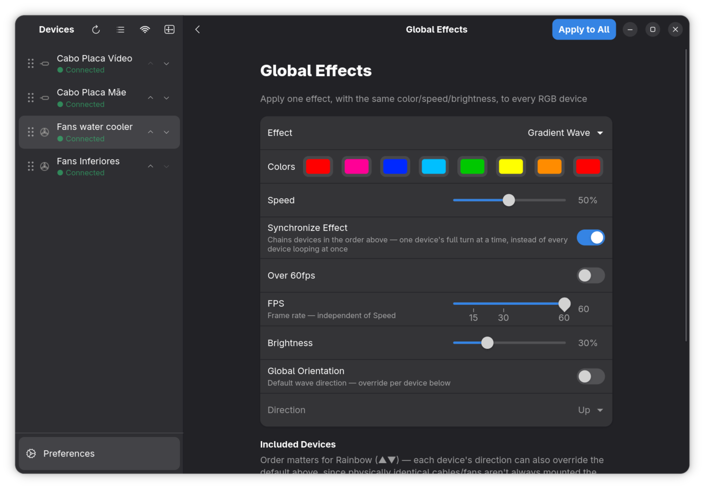
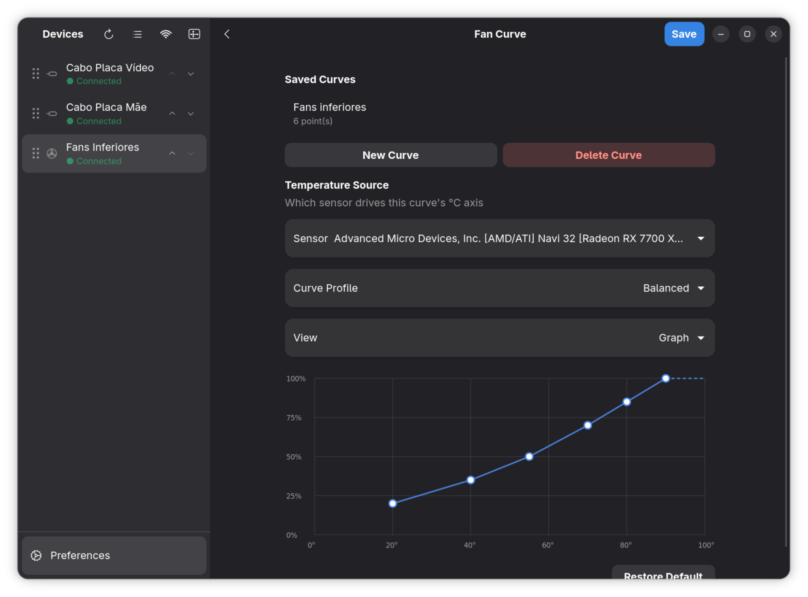
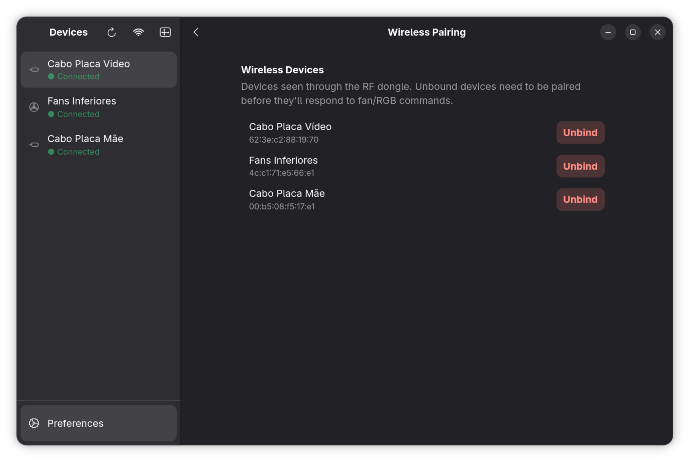
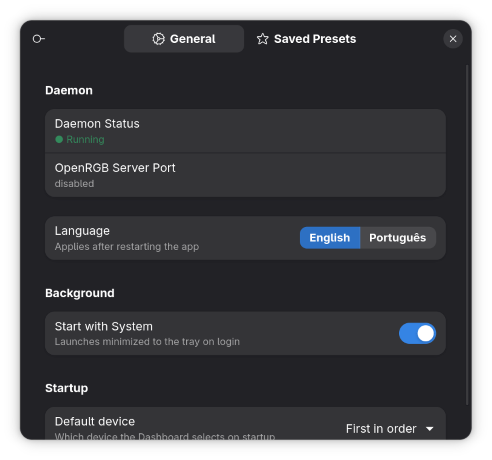

# Lian Li GTK

A native GTK4 + Libadwaita control panel for Lian Li fans, AIOs, and Strimer RGB cables (wired and wireless) on Linux — built to fit naturally into a GNOME desktop.

## Why this exists

Lian Li only ships **L-Connect 3** for Windows. On Linux, the excellent [**lian-li-linux**](https://github.com/sgtaziz/lian-li-linux) project by [sgtaziz](https://github.com/sgtaziz) reverse-engineered the USB/HID protocol for wired devices and the RF protocol used by the wireless dongle, and ships it as a background daemon (`lianli-daemon`) with a Slint-based GUI.

I use a fully wireless Lian Li setup (fans + Strimer cables over the RF dongle, no wired RGB headers at all), and wanted a client that felt like a first-class GNOME app — Libadwaita widgets, a design consistent with the rest of my desktop, and a couple of quality-of-life features I kept wanting (a proper "apply one effect to every device at once" screen, and effects that don't randomly drift back to old L-Connect/Windows state when a wireless device's firmware idle-watchdog resets).

**This project does not reimplement the protocol.** It's a frontend only — all USB/HID/RF communication, fan curves, LCD streaming, etc. still happen in the upstream `lianli-daemon`. This app talks to that daemon exactly like the original Slint GUI does, over its local IPC socket.

## Screenshots

| Dashboard                     | RGB Editor                           |
| ----------------------------- | ------------------------------------ |
|  |  |

| Global Effects                               | Fan Curve                          |
| -------------------------------------------- | ---------------------------------- |
|  |  |

| Wireless Pairing                                | Preferences                         |
| ----------------------------------------------- | ----------------------------------- |
|  |  |

## Features

- **Dashboard** — sidebar of every detected device (wired and wireless) with live telemetry (RPM, temps, pump speed) and quick actions.
- **RGB Editor** — per-device, per-zone effect editor. The mode list is built dynamically from whatever the daemon reports via `GetRgbCapabilities` for that specific device, not a hardcoded list.
  - Wireless devices (which only ever report `Static`/`Direct` at the protocol level) additionally get a client-rendered animation set: Rainbow, Rainbow Morph, Breathing, **Gradient Wave** (an OpenRGB-style custom multi-color wave, up to 8 gradient stops), and an L-Connect-style **Meteor** family (Meteor, Meteor Rainbow, Meteor Split) — all turned into raw frames on the client and streamed to the device.
  - **Segments** — split a strip into an edge/middle zone, each with its own solid color or independent animated effect.
  - Per-device wave direction, an invert-direction fix for physically reversed wiring, LED strip count (for cables that concatenate several physical strips into one flat buffer), and Meteor's linear-vs-circular (ring) topology are all remembered individually per device.
- **Global Effects** — apply one effect (Static, Rainbow, Rainbow Morph, Breathing, Gradient Wave, or the Meteor family, including a device-to-device Meteor relay) with shared color/speed/brightness/direction across every RGB-capable device at once, wired and wireless alike.
  - Rainbow and the Meteor relay treat every wireless device as a segment of one continuous virtual strip/relay chain, walking through a user-configurable device order — the same idea as L-Connect 3's cross-device sync.
  - **Sincronizar Efeito** — chains devices through one full turn each in sequence instead of every device looping independently at the same time.
- **Perfis (Profiles)** — save the entire current setup (RGB effects/colors per device, fan curves, LCD content, device order and sync settings) under a name, and switch back to it in one click. Captures both what the daemon persists on its own and the client-rendered wireless animations/Segments state that never round-trip through the daemon's config.
- **Fan Curve** — create, edit, and assign temperature → PWM curves per fan, with a draggable-point curve editor.
- **LCD Content** — preview and push image/video/GIF/color/sensor content to Strimer LCD displays.
- **Wireless Pairing** — bind/unbind devices to the RF dongle.
- **Preferences** — daemon status, OpenRGB bridge port, accent color, saved RGB presets (deleting a preset never resets the hardware — it only removes it from the list), language (English/Portuguese).
- **System tray** — minimize to tray instead of quitting; optional autostart on login.
- **Wireless-drift resilience** — applied effects are written through to the daemon's own config, so its existing auto-resync mechanism (which fixes a wireless device's firmware resetting its lighting on its own) replays the _current_ effect instead of stale leftover state.
  - The last effect applied to every device — including client-rendered wireless animations and Segments presets, neither of which live in the daemon's config — is automatically reapplied on reconnect, on app reopen after a reboot, and via the Identify button.
  - A periodic heartbeat quietly re-sends a running wireless animation every 20s, guarding against a device's firmware silently resetting its lighting to factory defaults without ever actually dropping off — all synced devices restart in lockstep so a cross-device relay never drifts out of phase.

## Supported Devices

This client has no per-device code — every device family goes through the same generic `ListDevices` → `GetRgbCapabilities` → `SetRgbEffect`/`SetRgbFrames`/fan-curve pipeline. The status below reflects how much validation each one has actually gotten against real hardware, not whether the code path exists.

### Tested against real hardware

| Device | Family | Interface | What was validated |
| --- | --- | --- | --- |
| UNI FAN SL-INF Wireless | `SlInf` | RF dongle | RGB (including per-fan Meteor band effect), fan curves, reconnect/heartbeat resilience |
| Strimer Plus Wireless | `WirelessStrimer` | RF dongle | RGB (per-cable LED strip layout calibrated against real strand counts) |

### Should work (same wireless pipeline, not personally tested)

| Device | Family |
| --- | --- |
| CL / RL120 Wireless Fan | `Clv1` |
| UNI FAN SL-V3 Wireless (LED only) | `Slv3Led` |
| UNI FAN TL-V2 Wireless (LED only) | `Tlv2Led` |
| Wireless AIO (WaterBlock / WaterBlock2) | `WirelessAio` |
| Wireless Lancool 217 RGB Ring | `WirelessLc217` |
| Wireless Lancool V150 Fan/RGB | `WirelessV150` |
| Wireless Universal Screen 8.8" LED Ring | `WirelessLed88` |

Same `ListDevices`/`GetRgbCapabilities`/`SetRgbFrames` calls as the two families above, nothing family-specific in this app. The main unknown for a new device is per-device calibration (LED strip count, Meteor ring offset) — same thing the Strimer cables above needed.

### Untested feature areas — LCD content, AIO pump control

No device this app has been developed against has an LCD screen or a controllable pump, so the LCD Content page and pump control have never been exercised on real hardware, on any family:

| Device | Family | Untested feature |
| --- | --- | --- |
| UNI FAN SL-V3 Wireless (LCD) | `Slv3Lcd` | LCD |
| UNI FAN TL-V2 Wireless (LCD) | `Tlv2Lcd` | LCD |
| Galahad II Trinity AIO | `Galahad2Trinity` | Pump + fan (wired) |
| HydroShift LCD AIO | `HydroShiftLcd` | Pump + fan + LCD (wired) |
| Galahad II LCD/Vision AIO | `Galahad2Lcd` | Pump + fan + LCD (wired) |
| HydroShift II LCD Circle AIO | `HydroShift2Lcd` / `HydroShift2LcdDesktop` | Pump + fan + LCD (wired) |
| TLLCD | `TlLcd` | LCD (wired) |
| Lancool 207 Digital | `Lancool207` / `Lancool207Desktop` | Case LCD (wired) |
| Universal Screen 8.8" | `UniversalScreen` / `UniversalScreenDesktop` | Screen (wired) |

### Wired-only, untested

| Device | Family |
| --- | --- |
| ENE 6K77 wired fans (SL/AL series) | `Ene6k77` |
| TL Fan controller | `TlFan` |
| Strimer Plus (wired, HID) | `StrimerPlus` |
| Universal Screen 8.8" LED Ring (HID) | `UniversalScreenLighting` |

This app has only ever been run against a fully wireless setup. The wired HID code path lives entirely in the upstream daemon and reports through the same `GetRgbCapabilities`/`SetRgbEffect` calls, so it should behave identically — it just hasn't actually been exercised from this client yet.

## Tech stack

- **[Rust](https://www.rust-lang.org/)** — the whole client.
- **[gtk4-rs](https://gtk-rs.org/)** / **[libadwaita-rs](https://gitlab.gnome.org/World/Rust/libadwaita-rs)** — UI toolkit, using `AdwNavigationSplitView`, `AdwToolbarView`, `AdwPreferencesGroup`/`ActionRow`/`ComboRow`, `AdwToast`, and GNOME's standard widget vocabulary throughout.
- **[`lianli-shared`](https://github.com/sgtaziz/lian-li-linux)** — the upstream project's own IPC/config/RGB types, pulled in as a pinned git dependency (`Cargo.toml`), so the wire format with the daemon never drifts out of sync with hand-copied structs.
- **`async-net` + `futures-lite`**, driven by `glib::spawn_future_local` — the IPC client talks to the daemon's Unix socket asynchronously on GTK's own main loop, no separate thread/channel plumbing.
- **`serde` / `serde_json`** — IPC message (de)serialization, plus this app's own small local preference files (per-device RGB direction, editor snapshots, saved device order/names, language, etc.) under `~/.config/lian-li-gtk/`.
- **`ksni`** — the `StatusNotifierItem` tray icon, running on its own thread and communicating back to the GTK main thread over a channel.

## Architecture

```
┌─────────────────────┐        Unix socket, newline-delimited JSON
│   lian-li-gtk (this)│◄──────────────────────────────────────────┐
│  gtk4 / libadwaita   │                                          │
└─────────────────────┘                                           │
                                                                  ▼
                                                     ┌───────────────────────┐
                                                     │     lianli-daemon      │
                                                     │  (from lian-li-linux)  │
                                                     │  USB/HID + RF dongle   │
                                                     └───────────────────────┘
                                                                   │
                                                                   ▼
                                                     ┌───────────────────────┐
                                                     │  Fans / AIOs / Strimer │
                                                     └───────────────────────┘
```

This app is a pure IPC client of `$XDG_RUNTIME_DIR/lianli-daemon.sock`. No driver code, no protocol implementation, and no device access lives in this repository.

## Requirements

- A running `lianli-daemon` from [lian-li-linux](https://github.com/sgtaziz/lian-li-linux) (see that project's README for installation — AUR package or build from source).
- GTK 4.12+ and libadwaita 1.5+ (whatever your distro ships is almost certainly new enough on anything released in the last couple of years).

## Building

```sh
cargo build --release
./target/release/lian-li-gtk
```

The `lianli-shared` dependency is pulled straight from the upstream repo at a pinned commit, so a plain `cargo build` is enough — no need to clone `lian-li-linux` separately just to build this client.

## Installing

```sh
./install.sh
```

Builds the release binary and installs it entirely under `$HOME` — no root needed:

- binary → `~/.local/bin/lian-li-gtk`
- app icon → `~/.local/share/icons/hicolor/scalable/apps/`
- app launcher entry → `~/.local/share/applications/`

After that, "LianLiGTK" shows up in your app launcher with its own icon (window, dock, and app switcher all use it — the tray icon is deliberately the same fan glyph used for fan devices in the sidebar instead). To remove everything the script installed:

```sh
./install.sh --uninstall
```

## Credits

- [sgtaziz/lian-li-linux](https://github.com/sgtaziz/lian-li-linux) — the daemon, the protocol reverse-engineering, and the shared types this client depends on entirely. This project would not exist without that work.
- Lian Li's own **L-Connect 3** — the reference for feature parity and, in the case of Gradient Wave, the general shape of an OpenRGB-style custom effect.
